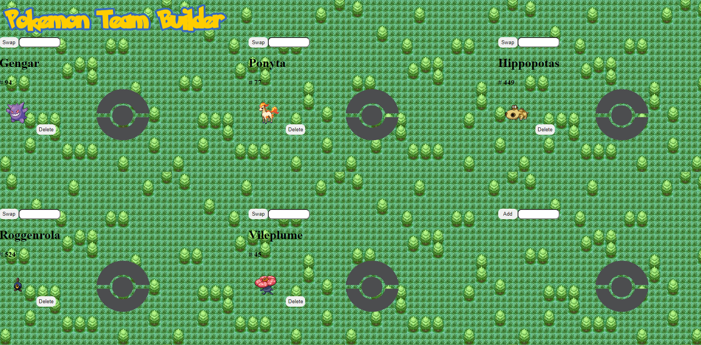

# Instructions
### An example CRUD app using only plain HTML, CSS, and Javascript
* This app auto-fills the first four slots.
* To add, type in a valid name/number of a Pokemon in the input box, then click add.
* To swap, type in a valid name/number of a Pokemon in the input box then click swap, then confirm swap.
* To Delete, click delete, then confirm delete.

